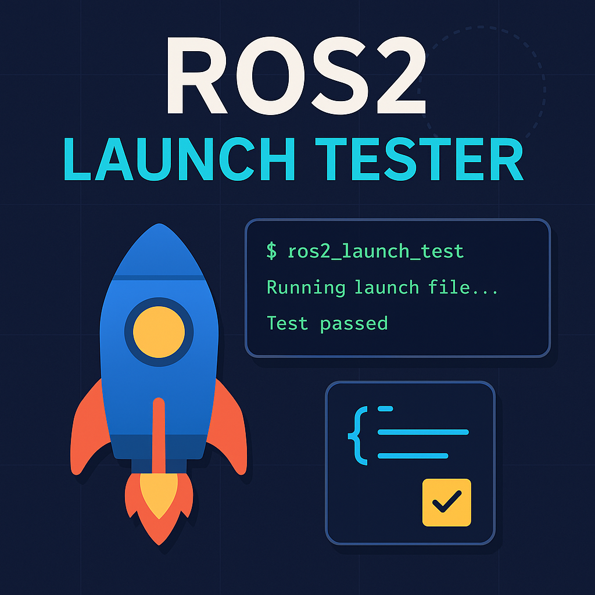

<div align="left">
  
</div>

# ROS2 Launch Tester 🧪

[](https://opensource.org/licenses/Apache-2.0)

## Project Overview

The **ROS2 Launch Tester** is a robust tool designed to automatically validate ROS2 launch files. It ensures that your ROS2 system components (nodes, topics, services, and parameters) are correctly initialized and available after a launch file is executed. This is invaluable for maintaining system integrity during development and within Continuous Integration (CI) pipelines.

**Goal:** Automatically test ROS2 launch files with verification of:
*   Nodes
*   Topics
*   Services
*   Parameters (placeholder for future implementation)
*   Health checks (optional, for future implementation)

**Target Audience:** ROS2 developers who want to validate their system setup during development or in CI environments.

## Features

*   ✅ **CLI Interface:** Easy-to-use command-line tool to run launch file tests.
*   ✅ **Entity Verification:** Checks for the existence of specified nodes, topics, and services.
*   ✅ **Timeout Handling:** Configurable timeouts for launch file startup and individual test categories.
*   ✅ **Rich Terminal Output:** Provides clear, color-coded progress indicators and a summary table of test results using `rich`.
*   ✅ **YAML Configuration:** Flexible test profiles defined in YAML for expected entities.
*   ✅ **Comprehensive Reporting:** Detailed pass/fail results for each checked item.
*   ✅ **Minimal Dependencies:** Built on core ROS2 Python libraries and common Python packages.

## Tech Stack

| Part              | Tool                                  | Description                                                              |
| :---------------- | :------------------------------------ | :----------------------------------------------------------------------- |
| ROS2 Interaction  | `rclpy`, `launch`                     | Python client library for ROS2, and ROS2's launch system.                |
| CLI Tool          | `Python argparse`, `rich`             | For command-line argument parsing and enhanced terminal output.          |
| Tests             | `pytest`                              | Python testing framework for unit and integration tests.                 |
| File Configuration| `YAML`                                | For defining expected nodes, topics, services, and parameters.           |
| Logging           | ROS2 logs + `stdout` capture          | Captures and displays output from the launched ROS2 processes.           |

## Installation

### Prerequisites

*   **ROS2:** Humble, Iron, or Rolling distribution installed and sourced.
    *   Verify with: `printenv ROS_DISTRO`
*   **Python 3.8+**
*   **`colcon` build tools:**
    ```bash
    sudo apt update
    sudo apt install python3-colcon-common-extensions
    ```

### Step-by-Step Setup

1.  **Create a ROS2 Workspace:**
    If you don't have an existing ROS2 workspace, create one:
    ```bash
    mkdir -p ~/ros2_launch_tester_ws/src
    cd ~/ros2_launch_tester_ws/src
    ```

2.  **Clone or Copy the Project:**
    Navigate into the `src` directory of your workspace and clone this repository:
    ```bash
    cd ~/ros2_launch_tester_ws/src
    git clone https://github.com/TheShaboury/ros2_launch_tester
    # Or if you downloaded the files, copy the 'ros2_launch_tester' folder here
    ```

3.  **Install Python Dependencies:**
    ```bash
    pip3 install rich pyyaml
    ```

4.  **Build the Package:**
    Navigate back to your workspace root and build the package:
    ```bash
    cd ~/ros2_launch_tester_ws
    colcon build --packages-select ros2_launch_tester
    ```

5.  **Create and Source Workspace Setup Script:**
    To ensure all necessary ROS2 environment variables and the `ros2-launch-test` command are available in your shell, create a setup script. This is crucial for the tool to correctly interact with the ROS2 graph.

    ```bash
    cat > ~/ros2_launch_tester_ws/setup_workspace.sh << 'EOF'
    #!/bin/bash
    # ROS2 Launch Tester Workspace Setup
    
    # Source your main ROS2 installation
    source /opt/ros/$ROS_DISTRO/setup.bash
    
    # Source your workspace install directory
    source ~/ros2_launch_tester_ws/install/setup.bash
    
    # Add the workspace's bin directory to PATH for console scripts
    export PATH="$HOME/ros2_launch_tester_ws/install/bin:$PATH"
    
    # Set ROS_DOMAIN_ID for consistent communication (choose any integer, e.g., 0)
    # This ensures your tester and launched nodes are on the same ROS domain.
    export ROS_DOMAIN_ID=0 
    
    echo "ROS2 Launch Tester workspace activated! ROS_DOMAIN_ID set to $ROS_DOMAIN_ID"
    EOF
    
    chmod +x ~/ros2_launch_tester_ws/setup_workspace.sh
    ```
    **Important:** You must `source` this script in every new terminal session where you want to use `ros2-launch-test`:
    ```bash
    source ~/ros2_launch_tester_ws/setup_workspace.sh
    ```

6.  **Verify Installation:**
    After sourcing the script, test if the command is available:
    ```bash
    ros2-launch-test --help
    ```
    You should see the help message for the tool.

## Usage

### Basic Usage

Run a launch file and automatically discover all running nodes, topics, and services:

```bash
ros2-launch-test /path/to/your/launch_file.py
```

### Using a Configuration File (Recommended)

Create a YAML configuration file to specify exactly what nodes, topics, and services you expect to be present.

1.  **Generate a sample config:**
    ```bash
    ros2-launch-test --create-config my_test_config.yaml
    ```
    This will create `my_test_config.yaml` in your current directory. You can move it to `src/ros2_launch_tester/config/` for better organization.

2.  **Edit the configuration file** to define your expectations (see [Configuration File Format](#configuration-file-format) below).

3.  **Run tests with your config:**
    ```bash
    ros2-launch-test /path/to/your/launch_file.py --expect /path/to/your/config_file.yaml
    # Example: ros2-launch-test /opt/ros/$ROS_DISTRO/share/turtlesim/launch/multisim.launch.py --expect src/ros2_launch_tester/config/turtlesim_test.yaml
    ```

### Example: Testing Turtlesim (`multisim.launch.py`)

This example demonstrates how to test the `multisim.launch.py` from the `turtlesim` package, which launches two turtlesim instances (`/turtlesim1turtlesim` and `/turtlesim2turtlesim`).

1.  **Ensure your workspace is sourced** (as per step 5 in Installation).
    ```bash
    source ~/ros2_launch_tester_ws/setup_workspace.sh
    ```

2.  **Create the `turtlesim_test.yaml` configuration file:**
    Place this file in `~/ros2_launch_tester_ws/src/ros2_launch_tester/config/turtlesim_test.yaml`.

    ```yaml
    # ROS2 Launch Tester Configuration Example for multisim.launch.py
    # Specify what to expect from your launch file

    # List of nodes that should be running
    # multisim.launch.py launches two turtlesim nodes with specific names
    nodes:
      - "/turtlesim1turtlesim"
      - "/turtlesim2turtlesim"

    # List of topics that should exist
    # Topics are namespaced under the turtle nodes
    topics:
      - "/turtlesim1/turtle1/cmd_vel"
      - "/turtlesim1/turtle1/pose"
      - "/turtlesim2/turtle1/cmd_vel"
      - "/turtlesim2/turtle1/pose"
      - "/parameter_events" # Common ROS2 topic
      - "/rosout" # Common ROS2 topic

    # List of services that should be available
    # Services are namespaced under the turtle nodes
    services:
      - "/turtlesim1/turtle1/set_pen"
      - "/turtlesim1/turtle1/teleport_absolute"
      - "/turtlesim1/turtle1/teleport_relative"
      - "/turtlesim1/clear"
      - "/turtlesim1/kill"
      - "/turtlesim1/reset"
      - "/turtlesim1/spawn"
      - "/turtlesim2/turtle1/set_pen"
      - "/turtlesim2/turtle1/teleport_absolute"
      - "/turtlesim2/turtle1/teleport_relative"
      - "/turtlesim2/clear"
      - "/turtlesim2/kill"
      - "/turtlesim2/reset"
      - "/turtlesim2/spawn"
      # Common ROS2 services for parameter management (from launch_tester node itself)
      - "/launch_tester/describe_parameters"
      - "/launch_tester/get_parameters"
      - "/launch_tester/list_parameters"
      - "/launch_tester/set_parameters"
      - "/launch_tester/set_parameters_atomically"

    # Optional timeout settings
    timeout:
      startup: 5.0    # seconds to wait for launch file startup
      tests: 30.0     # seconds to wait for each test category
    ```

3.  **Run the test command:**
    ```bash
    ros2-launch-test /opt/ros/$ROS_DISTRO/share/turtlesim/launch/multisim.launch.py --expect src/ros2_launch_tester/config/turtlesim_test.yaml
    ```
    You should now see a "🎉 All tests passed!" message.

### Advanced Options

*   **Custom Timeout and Startup Time:**
    ```bash
    ros2-launch-test launch_file.py --timeout 60 --startup-time 5
    ```
*   **Verbose Output:** (Currently, debug prints are integrated directly into the code for detailed output)

## Configuration File Format

The configuration file is a YAML file that defines the expected state of your ROS2 graph after a launch file runs.

```yaml
# Expected nodes (list of full node names, including namespaces if applicable)
nodes:
  - "/my_robot_node"
  - "/sensor_driver"
  - "/my_namespace/my_node"

# Expected topics (list of full topic names)
topics:
  - "/cmd_vel"
  - "/scan"
  - "/odom"
  - "/my_namespace/my_topic"

# Expected services (list of full service names)
services:
  - "/reset_odometry"
  - "/start_mapping"
  - "/my_namespace/my_service"

# Expected parameters (optional, placeholder for future implementation)
# Format: "/node_name/param_name": expected_value
parameters:
  "/my_robot_node/max_speed": 1.0
  "/sensor_driver/frame_id": "laser"

# Timeout settings (optional)
timeout:
  startup: 5.0    # seconds to wait for the launch file to start up
  tests: 30.0     # seconds to wait for each category of tests (nodes, topics, services)
```

## Development

### Running Unit Tests

Navigate to your workspace root and run the tests:

```bash
cd ~/ros2_launch_tester_ws
colcon test --packages-select ros2_launch_tester
colcon test-result --verbose
```

### Project Structure

```
ros2_launch_tester_ws/
├── build/
├── install/
├── log/
└── src/
    └── ros2_launch_tester/
        ├── ros2_launch_tester/
        │   ├── __init__.py          # Package initialization
        │   ├── tester.py            # Main LaunchTester class and logic
        │   ├── node_checker.py      # Logic for verifying ROS2 nodes
        │   ├── topic_checker.py     # Logic for verifying ROS2 topics and services
        │   └── ros2_launch_test.py  # CLI entry point script
        ├── config/
        │   ├── sample_expect.yaml   # Example configuration file
        │   └── turtlesim_test.yaml  # Configuration for turtlesim example
        ├── resource/
        │   └── ros2_launch_tester   # ROS2 package marker file
        ├── tests/
        │   ├── __init__.py          # Tests package initialization
        │   └── test_minimal.py      # Unit tests for core components
        ├── package.xml              # ROS2 package manifest
        ├── setup.py                 # Python package setup file
        └── README.md                # This documentation file
```

## Troubleshooting

### Common Issues

1.  **`ros2-launch-test: command not found`**
    *   **Solution:** Ensure you have sourced your workspace setup script in the current terminal session:
        ```bash
        source ~/ros2_launch_tester_ws/setup_workspace.sh
        ```
